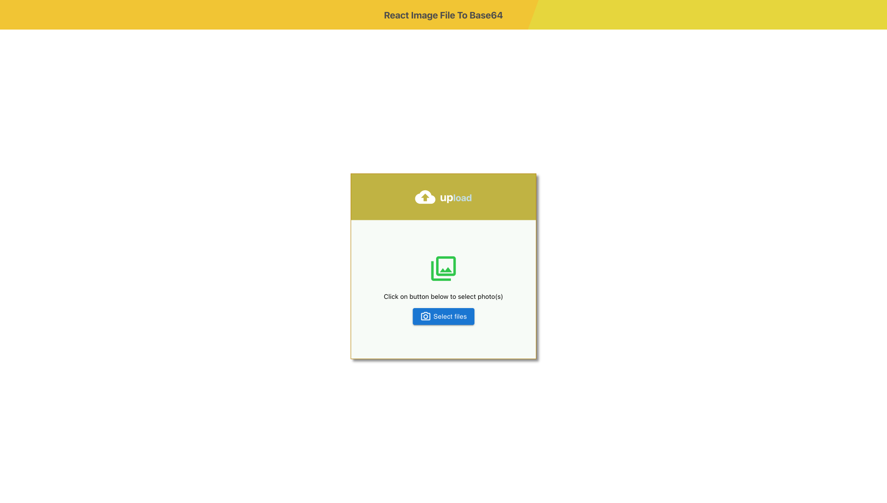
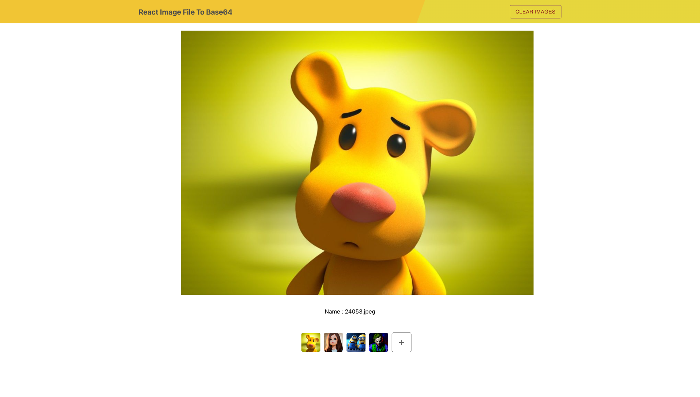

# 🚀 React-Image-File-To-Base64

## ⏺ Introduction

A simple React Component that helps converts image files from file type to base64 type.




---

## 🔧 Installation

      $ npm install --save react-image-file-to-base64

---

## 📖 Usage

### Import the Package

```javascript
import ReactImageFileToBase64 from "react-file-image-to-base64";
```

### Example with multiple set to false on input file type -

```javascript
const ExampleWithMultipleFalse = () => {
  const [image, setImage] = useState({});

  const handleOnCompleted = files => {
    //GET THE FIRST AND ONLY FILE IN THE ARRAY WHICH IS AN OBJECT
    setImage(files[0]);
  };
  return (
    <div>
      <ReactImageFileToBase64 onCompleted={handleOnCompleted} />
    </div>
  );
};
```

### Example with multiple set to true on input file type -

```javascript
const ExampleWithMultipleTrue = () => {
  const [images, setImages] = useState([]);

  const handleOnCompleted = files => {
    setImages(files);
  };
  return (
    <div>
      <ReactImageFileToBase64 multiple={true} onCompleted={handleOnCompleted} />
    </div>
  );
};
```

### Example with preffered text in default input button -

```javascript
const ExampleWithPreferredText = () => {
  const [image, setImage] = useState([]);

  const handleOnCompleted = files => {
    setImage(files[0]);
  };

  return (
    <div>
      <ReactImageFileToBase64
        multiple={false} // MULTIPLE IS SET TO FALSE BY DEFAULT, SO FEEL FREE TO REMOVE THIS  CHUNK IF YOU WANT
        onCompleted={handleOnCompleted}
        preferredButtonText="Click Me !"
      />
    </div>
  );
};
```

### Example with customised button type -

```javascript
const ExampleWithCustomButton = () => {
  const [images, setImages] = useState([]);

  const handleOnCompleted = files => {
    setImages(files);
  };

  //CREATE A CUSTOMISED BUTTON COMPONENT TO YOUR TASTE
  const CustomisedButton = ({triggerInput}) => {
    //A PROP IS RETURNED TO YOUR CUSTOMISED BUTTON NAMED -triggerInput
    //MAKE SURE YOU GET THE PROP AND ADD IT TO AN ONCLICK EVENT ON YOUR CUSTOMISED BUTTON
    //triggerInput PROP OPENS UP POP OF DEVICE TO SELECT IMAGE
    return (
      <div>
        <button onClick={triggerInput}>Upload an Image</button>
      </div>
    );
  };
  return (
    <div>
      <ReactImageFileToBase64
        onCompleted={handleOnCompleted}
        CustomisedButton={CustomisedButton}
        multiple={true}
      />
    </div>
  );
};
```

Note that the `result` returns an array of object(s) in this format:

```javascript
[
  {
    base64_file: "THE_BASE64_FILE"
    default_file: "THE_ORIGINAL_FILE"
    file_name: "NAME_OF_FILE.jpeg"
    file_size: "SIZE_OF_FILE KB"
    file_type: "FILE_TYPE image/jpeg"
    last_modified: "LAST_MODIFIED_DATE_OF_FILE 2022-02-17T21:01:30+01:00"
  }
]

```

### Options :

| Option              |   Type    |   Default    | Description                                                                                                        |
| ------------------- | :-------: | :----------: | ------------------------------------------------------------------------------------------------------------------ |
| Multiple            |  Boolean  |    false     | it specifies that the user is allowed to select more than one image.                                               |
| preferredButtonText |  String   | Select files | The text displayed within the button that's clicked on to prompt user to select image files.                       |
| onCompleted         | Function  |    \_\_\_    | Function to run when user is done selecting image(s), returns the image files converted from files to Base64.      |
| CustomisedButton    | Component |    \_\_\_    | Create your own customised button component and include it to overule the default button component in the package. |

---

## 👍🏽 Feel Free to Contribute

### 1 - Fork the Repository

Fork this repository by clicking on the fork button on the top of this page. This will create a copy of this repository in your account.

### 2 - Clone your fork Repository

Now clone the forked repository to your machine. Go to your GitHub account, open the forked repository, click on the Code button and then click the copy to clipboard icon to copy the HTTPS.

Open a terminal on your machine and run the following git command :

      git clone {the HTTPS url you just copied}

You should have :

      //Please note that your account username should be where "sulaimon-olaniran" is as you're copying from your forked repo, which is in your own account

      git clone https://github.com/sulaimon-olaniran/react-image-file-to-base64.git

- Navigate

### 3 - Navigate to Your Local Repository

Navigate to the local repository using:

    cd NAME_OF_REPOSITORY

For example :

    cd react-image-file-to-base64

### 4 - Check That Your Fork is the "Origin" Remote

When you cloned your fork, that should have automatically set your fork as the "origin" remote.
to check current remote use :

    git remote -v

you should see of the URL of your forked repository. If you don't see it, you can add it by running the following command :

    git remote add origin URL_OF_FORKED_REPO

### 5 - Add the project repository as the "upstream" remote

Go to the original repository of the project, click on the Code button and then copy the HTTPS URL.

Add the project repository as the "upstream" remote using:

    git remote add upstream URL_OF_PROJECT

For example :

    git remote add upstream https://github.com/sulaimon-olaniran/react-image-file-to-base64.git

### 6 - Pull the latest changes from upstream into your local repository

Synchronize your local repository with the project repository by running the following code :

    git pull upstream main

### 7 - Create a Branch

When you're certain you're in the repository directory, create a branch using the `git checkout` command

```
git checkout -b your-new-branch-name
```

For example

```
git checkout -b updated-readme-file
```

The name of the branch should briefly describe what you are working on, and should not contain any spaces.

You can use `git branch` to show your local branches

### 8 - Make changes in your local repository

Use a text editor or IDE to make the changes you planned to the files in your local repository. Because you checked out a branch in the previous step, any edits you make will only affect that branch.

### 9 - Commit and push your changes

After you've made changes, run the code below to stage all your changes

```
  git add .
```

When your changes are stagged, commit your changes with a message.

for example:

```
git commit -m "fix typos in Readme.md file"
```

After you've commited your changes, push the changes to your fork repository by running the command :

      git push origin BRANCH_NAME.

So far we named our branch name `updated-readme-file`

For example :

    git push origin updated-readme-file

### 10 - Pull Request

Return to your fork on GitHub, and refresh the page. You may see a highlighted area that displays your recently pushed branch

Click the green Compare & pull request button to begin the pull request.

Alternatively, if you don't see this highlighted area, you can switch to your branch using the Branch button and then click the New pull request button.

That's all from your side 🤝🏽

Soon I'll be reviewing and merging all your changes into the main branch of this project. You will get a notification email once the changes have been merged.

---

## Test and Run Package Locally

After you must have made your preffered changes to the package, follow the below steps to run and test your version of the app locally;

### 1 - Convert the Typescript file into Javascript in a dist folder

Open a terminal and navigate to the package folder

From the package folder, Make sure you're in the package folder, if not run;

      cd package

Use `npx tsc` to convert the code from typescript to javascript into a dist folder. So run;

      npx tsc

### 2 - Install the package locally into the test-package react application

In the terminal, navigate into the `test-package` folder

To install the `react-image-file-to-base64` package globally, you can use a package called `install-local`

If you don't have the package, simply install it by running :

    npm install -g install-local

After you've installed `install-local`

Now install the `react-image-file-to-base64` package locally into the test-package react application
by running:

    install-local --save ../package

This will install the `react-image-file-to-base64` package locally in the test-package application.

If you check in the package.json file of the test-package folder, you should see the following:

```json
 "localDependencies": {
    "react-file-image-to-base64": "../package"
  }
```

### 3 - Run the app and check if everything works as you want

Simply start the test-package react application by running :

      npm start

The app should run in your browser locally, and you can locally test how the package works with the application.

### P.S :

If after running the above process, and you've later made some new changes to the package, and you want the new changes to reflect in the test-package application.

In your terminal, in the test-package folder, run:

    npm run update:react-file-image-to-base64

Make sure to restart your app by running `npm start` so the changes can be included.

---

## 💡 Reflection

It was a simple straight forward project to build, but it wasn't so easy for me as it's the first project I'm building using Typescript and not Javascript and also my first NPM package as well. It was fun though, asides from the part where TS kept
yelling error error error at me 🙉.

---

## ✅ Acknowledgements

- Naufal Rabbani - [react-file-base64](https://github.com/BosNaufal/react-file-base64)

- MDN Web Docs - [FileReader.readAsDataURL()](https://developer.mozilla.org/en-US/docs/Web/API/FileReader/readAsDataURL)

---

---

## 📝 License

[](https://opensource.org/licenses/MIT)

Copyright (c) 2022 Sulaimon Olaniran

---

## 📍 Contact

- Email : sulaimon.olaniran95@gmail.com
- Twitter : [sulai_m0n](https://twitter.com/sulai_m0n)
